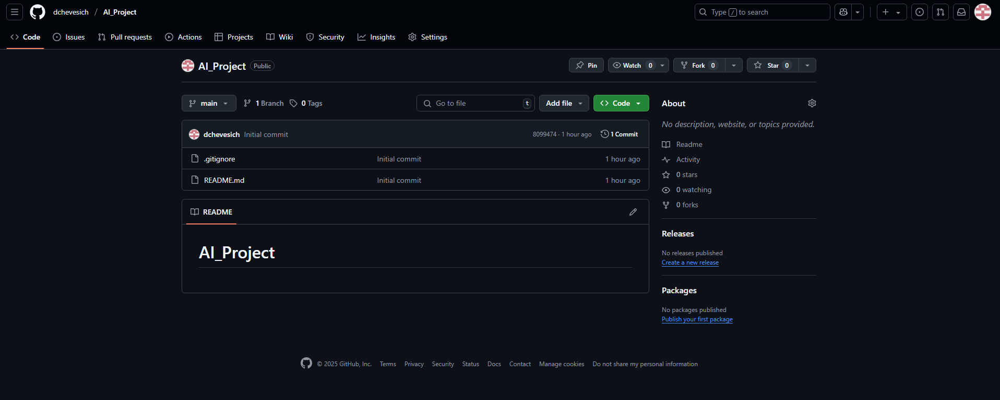

# AI_Project

# AI_Project: Exploración de Inteligencia Artificial con GitHub Copilot

## 1. Introducción y Objetivo

Este repositorio documenta la actividad formativa diseñada para explorar las tendencias emergentes en Inteligencia Artificial (IA) utilizando **GitHub Copilot** como una herramienta práctica. El objetivo principal fue comprender y aplicar las capacidades de esta herramienta de asistencia de código impulsada por IA en el contexto del desarrollo de un sistema de recomendación.

## 2. Proceso de Configuración Inicial

### 2.1 Configuración de Cuenta GitHub y Acceso a Copilot

Se utilizó una cuenta de GitHub existente y se accedió a GitHub Copilot siguiendo el proceso de obtención de la **alternativa gratuita** disponible para la herramienta. Esto implicó la activación de GitHub Copilot en las configuraciones de la cuenta, asegurando que estuviera listo para ser utilizado en el entorno de desarrollo.

### 2.2 Creación del Repositorio Remoto

Se creó un nuevo repositorio en GitHub llamado "AI_Project". Se configuró como Público y se le añadió un archivo `README.md` inicial, un archivo `.gitignore` y una licencia [si aplicó].

### 2.3 Clonación del Repositorio Localmente

Una vez creado el repositorio en GitHub, se clonó localmente utilizando Visual Studio Code y su terminal integrada.

git clone [https://github.com/dchevesich/AI_Project.git]
cd AI_Project

### 3. Desarrollo de Código con GitHub Copilot

### 3.1 Creación del Archivo recommendation_system.py

Dentro del repositorio local AI_Project en Visual Studio Code, se creó un nuevo archivo llamado recommendation_system.py.

### 3.2 Generación de Código Inicial con GitHub Copilot

Para generar el código inicial de un sistema de recomendación de películas, se utilizó GitHub Copilot. Al escribir comentarios descriptivos y la firma de la función recommend_movies, Copilot sugirió automáticamente un bloque de código para cargar datasets (simulados por archivos .csv), filtrar películas vistas por el usuario, calcular promedios de calificaciones y devolver recomendaciones.

Evidencia del uso de GitHub Copilot para la generación de código

### 4. Commit y Push de los Cambios
Una vez generado el código con Copilot y actualizado el README.md con la documentación, los cambios fueron guardados, agregados al área de preparación, se realizó un commit y se subieron al repositorio remoto en GitHub.

git add .
git commit -m "feat: Implementacion inicial de sistema de recomendacion con GitHub Copilot y actualizacion de README.md"
git push origin main
(Si tu rama principal se llama master, cambia main a master en el comando git push.)

5. Enlace del Repositorio
Puedes acceder al repositorio de este proyecto a través del siguiente enlace:

https://github.com/dchevesich/AI_Project.git
